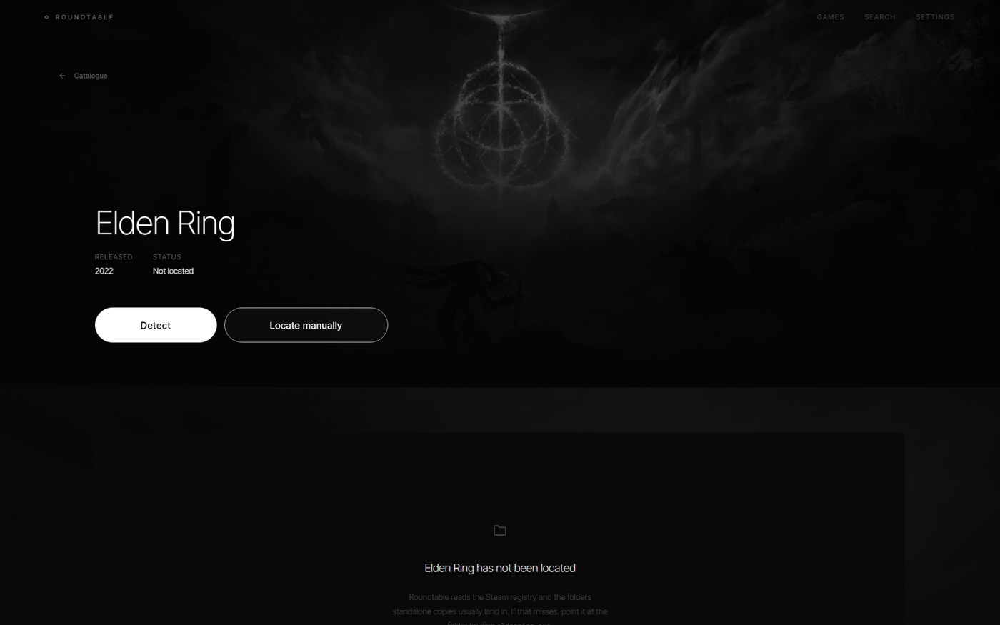
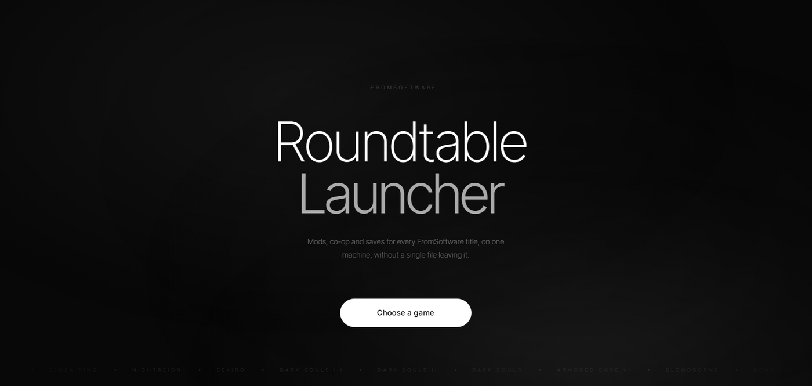
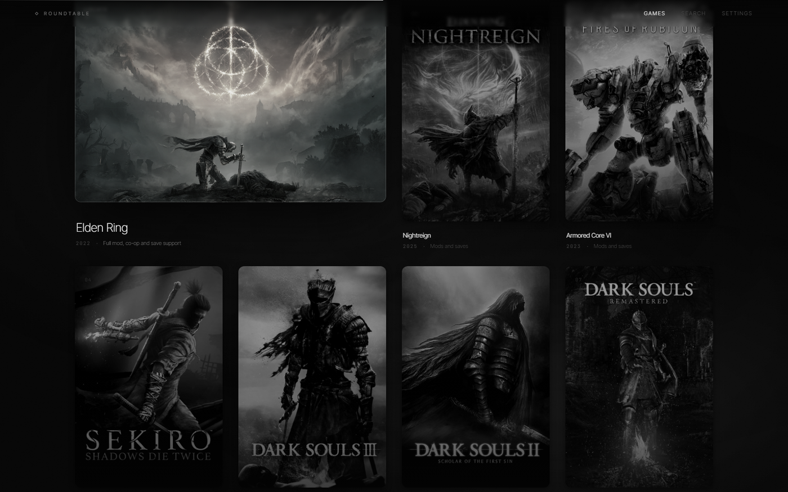

<div align="center">


# Roundtable

**Mod, co-op and save management for ELDEN RING and other FromSoftware titles.**

Windows · no account · no telemetry · MIT

[](../../releases/latest)
[](../../releases)
[](LICENSE)


</div>

---

Roundtable exists because three things that should be simple are not: running a large
overhaul alongside Seamless Co-op, starting a modded game on a copy that does not come
from Steam, and moving a character between two installations that use different account
ids. Each has a known answer. None of them is one click. This makes them one click.

## How it runs

The app opens a small window, starts a web server on loopback, and hands the address to
your browser. The interface is a real page in a real browser; the window stays alive
behind it because a browser cannot open a folder picker and the desktop side can.

<div align="center">

</div>

Nothing is exposed. The listener binds to `127.0.0.1` on a port the OS picks, every
request carries a session key generated at startup, and anything without it gets a 401.
The address dies with the process.

---

## What it does

### Launching

The launcher does not guess. It inspects the installation, works out which chain will
actually start the game, shows you that plan, and only then runs it.

- Finds installations through the Steam registry and `libraryfolders.vdf`, and in the
  folders standalone copies usually land in.
- Tells a Steam copy from a standalone one by looking for Steamworks emulator files, and
  reports which files it found so the classification is never a black box.
- Detects **ModEngine 2** and **me3** wherever they are, including the copy a large mod
  bundles with itself.
- Prefers me3 when both are present: it is the maintained loader, and the only one with
  `--skip-steam-init`.
- On a standalone copy, passes `--skip-steam-init` and writes `steam_appid.txt`. This is
  the fix for *"trying to find steam"*.
- Warns, rather than failing silently, when ModEngine 2 is the only loader on a
  standalone copy, because it has no equivalent flag.

### Mods and profiles

- Mods live in Roundtable's own library, never in the game folder. Both loaders take
  absolute paths, so a normal profile writes nothing into the game directory at all.
- Reads `zip` and `7z` archives as downloaded. Wrapper folders, bundled loaders and
  stray readme files are all handled; the layer that actually holds the game assets is
  found and promoted.
- A profile is a load order plus its launch settings. Switching between vanilla and a
  full overhaul moves no files.
- Conflict detection lists every file two mods both provide and names the winner.
- When several mods ship `regulation.bin`, it says so plainly: only the first takes
  effect, and the others' balance changes are discarded.
- Optional junction deployment for older tools that insist on a literal `mod` folder
  next to the game. A real directory in the way is never deleted.

<div align="center">

</div>

### Seamless Co-op

- Every option the mod reads, with its own documentation, in a real editor.
- Writes `ersc_settings.ini` in place, comments intact.
- Password generator, and a one-key roll from the command palette.
- Scaling presets, plus every value individually.
- Refuses a save extension of `sl2`, which is the one setting that makes co-op overwrite
  a solo character.
- Wires `ersc.dll` into whichever loader is in use, alongside the rest of the profile.

### Saves

`.sl2` and `.co2` are the same container. The account id is written inside it, which is
why copying the file between a Steam copy and a standalone one does not work.

- Lists every save folder, labelling Steam accounts by name and flagging the rest.
- Reads each container: character names, levels, playtime and checksum validity.
- Transfers characters between saves, rewriting every occurrence of the source account id
  and recomputing the MD5 checksums the game verifies.
- Converts between extensions, optionally rebinding to another account in the same pass.
- Snapshots before every launch and before anything that writes, with pruning that never
  touches a manual snapshot.
- Finds byte-identical duplicates across folders.
- Writes through a temporary file, so a crash mid-write cannot leave half a character.

### Tools

- Clears NVIDIA, AMD, Intel and DirectX shader caches, and reports what it reclaimed.
  Paths are validated against a whitelist, so nothing outside a real cache is touched.
- Anti-cheat toggle that shows the current state, explains what changes, and keeps the
  original file for restoring.
- Machine report: CPU, memory, disks, whether Steam and the game are running.

---

## The catalogue

<div align="center">

<br><br>

</div>

| Title | Year | Support |
| --- | --- | --- |
| ELDEN RING | 2022 | Mods, Seamless Co-op, saves, anti-cheat |
| ELDEN RING NIGHTREIGN | 2025 | Mods and saves |
| ARMORED CORE VI | 2023 | Mods and saves |
| Sekiro: Shadows Die Twice | 2019 | Mods and saves |
| DARK SOULS III | 2016 | Mods and saves |
| DARK SOULS II: Scholar of the First Sin | 2014 | Saves and system tools |
| DARK SOULS: Remastered | 2011 | Saves and system tools |
| Bloodborne | 2015 | Listed only — PlayStation exclusive |
| Demon's Souls | 2009 | Listed only — PlayStation exclusive |

---

## Safety

The parts that can lose data are the parts with tests.

- Every save write is preceded by a snapshot and performed atomically.
- Checksums are recomputed on every write, because the game rejects a save whose
  checksums do not match.
- Junction removal refuses to act on a real directory.
- Cache clearing refuses paths outside a known cache location.
- Archive extraction drops entries that try to escape the destination.
- Anti-cheat changes are reversible and never touch saves.

```
cargo test    145 passed
```

There is no telemetry, no analytics and no account. The only network requests the app
makes are ones you start.

---

## Installing

Grab the installer from [Releases](../../releases). It installs for the current user, so
it needs no administrator prompt.

## Building

Requires Rust 1.82+, Node 20+, and the MSVC build tools.

```powershell
npm install
npm run app          # development
npm run app:build    # installer
```

`cargo build` alone will not produce a working binary: Tauri embeds the frontend during
`tauri build`, so use the npm scripts above.

---

## Layout

```
src/                  the interface, served to your browser
  components/         motion primitives, command palette, shared UI
  pages/              Landing, Stage, and the panes inside it
  lib/                HTTP transport, app state, scroll and pointer readings
src-tauri/src/
  server.rs           the loopback server and its session key
  dialog.rs           native folder and file pickers, for the browser to call
  game.rs             installation discovery and classification
  steam.rs            registry, VDF parsing, local accounts
  loader.rs           ModEngine 2 and me3 configuration
  launch.rs           the launch planner
  coop.rs             Seamless Co-op settings
  saves.rs            discovery, backup, transfer, conversion
  formats/save.rs     the .sl2 container
  mods.rs             library, profiles, conflicts, junctions
  install.rs          archive extraction and layout detection
  eac.rs              anti-cheat toggle
  sys.rs              shader caches and system reporting
```

Rust, TypeScript, React and a Tauri shell. The interface runs on Motion and Lenis; the
backend on axum, with the frontend compiled into the binary.

---

## Credits

The formats this tool reads were documented by the people who reverse engineered them.
`ModEngine2` and `me3` define the loader configurations; `EldenRingSaveCopier` and
`ER-Save-Editor` established the save container layout. Seamless Co-op is by LukeYui.

Cover art belongs to FromSoftware and Bandai Namco, and is shown for identification only.

MIT licensed.
